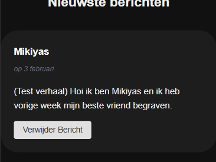

# Interactive Functionality

Ontwerp en maak voor een opdrachtgever een interactieve toepassing die voor iedereen toegankelijk is

De instructie vind je in: [INSTRUCTIONS.md](https://github.com/fdnd-task/the-web-is-for-everyone-interactive-functionality/blob/main/docs/INSTRUCTIONS.md)

## Inhoudsopgave

  * [Beschrijving](#beschrijving)
  * [Gebruik](#gebruik)
  * [Kenmerken](#kenmerken)
  * [Installatie](#installatie)
  * [Bronnen](#bronnen)
  * [Licentie](#licentie)

## Beschrijving
<!-- Bij Beschrijving staat kort beschreven wat voor project het is en wat je hebt gemaakt -->

Het project waar ik aan heb gewerkt heet Drop and Heal 
Drop and Heal is een applicatie/platform waarbij mensen die een dierbare
zijn verloren hun verhaal kunnen delen met mensen die het zelfde hebben meegemaakt hiermee creert drop and heal een plek voor die mensen om hun emoties vrij uit te kunnen delen inplaats van dat ze hun emoties voor hun zelf houden en zichzelf daardoor emotioneel maken 

en tijdens deze sprint lag de focus op de chat functie waarbij eind gebruikers dus hun verhaal kunnen delen

<!-- Voeg een mooie poster visual of video toe 📸 -->

<!-- Voeg een link toe naar GitHub Pages 🌐-->

[Drop and Heal website gebruik /chat in de zoekbalk achter .com zodat je de chatfunctie kunt zien](https://the-web-is-for-everyone-interactive-ew9n.onrender.com/)

## Gebruik
<!-- Bij Gebruik staat de user story, hoe het werkt en wat je er mee kan. -->
Hoe het werkt is als volgt om een bericht te kunnen plaatsen klik je op de blauwe knop rechts onder waarop staat "Plaats bericht"

nadat je daarop hebt geklikt zie je een soort pop-up waarin staat waar je naam kunt invullen en je verhaal kunt doen 

wanneer je alles hebt ingevuld kun je ervoor kiezen om je verhaal te delen door op ervaring delen te klikken 

stel dat jij je verhaal hebt gedeelt maar je er toch niet fijn bij voelt om het te delen dan heb je de mogelijkheid om je bericht te verwijderen 

## Kenmerken
<!-- Bij Kenmerken staat welke technieken zijn gebruikt en hoe. Wat is de HTML structuur? Wat zijn de 
belangrijkste dingen in CSS? Wat is er met JS gedaan en hoe? Misschien heb je iets met NodeJS gedaan, of heb je een framework of library gebruikt? -->

### HTML 
Voor html heb ik gebruik gemaakt van semantische html waarbij ik dus netjes en geordend me html schrijf zodat andere mensen (developers) mijn html goed kunnen begrijpen en dit helpt ook met het meer toegankelijk maken van mijn applicatie 

ik gebruik bijv <header>,

 <section>, 
 

 <main> 
 

 en daarin komt al mijn html content in te staan wat de eindgebruiker te zien krijgt 

 ### Css
De Css heb ik gebruikt om mijn website te stylen hierin heb ik veel gebruik gemaakt van een flex-layout dit heb ik gedaan omdat een flex layout me helpt om dingen op mijn site netjes en flexibel te positioneren en omdat ik ook een <overlay> gebruik ( die pop up) is het handig om een flexibele mogelijkheid te hebben om dit te kunnen toepassen bijv>

[voorbeeld van display flex](https://github.com/Mikiyas-hs/the-web-is-for-everyone-interactive-functionality/blob/b0cc150d11911cd406fecc27f74b9b47602ef695/public/chat.css#L18-L21)

waarom: ik wil dat de beschrijving onder elkaar staan op mobile 
flex maakt dit super eenvoudig met `flex-direction: column`

daarnaast heb ik ook gebruik gemaakt van media queries in mijn css code [media queries](https://github.com/Mikiyas-hs/the-web-is-for-everyone-interactive-functionality/blob/b0cc150d11911cd406fecc27f74b9b47602ef695/public/chat.css#L47-L50) zorgen ervoor dat je website er goed uitziet op verschillende grotere schermformaten 

### JS
Ik heb met Js API data opgehaald via de directus api daarin staan alle gegevens die ik nodig heb om de website te voorzien van gegevens die handig kunnen zijn en die gegevens haal ik op door een fetch te doen en dmv een get route haal ik een bepaalde gegeven op die behoort bij een bepaalde oefening in de applicatie  

Daarnaast kan je ook posten waarbij je dus in een fomrulier iets kunt invullen dit word gestuurd als json naar de directus api waar de nieuwe gegevens word opgeslagen je dit weer terug kunt zien op de website

daarnaast heb ik ook een delete functie gemaakt waarbij een bericht met een bepaalde id via een delete aanvraag naar de directus api of te wel het doet een request om dat specifieke bericht te verwijderen in de database

Samengevat met extra info

- ik heb liquid gebruikt om dynamische templates te renderen
- fetch gebruikt om data op te halen en te versturen naar de api 
- formulier verwerkt met post request 
- dynamische routes opgezet om te posten en te verwijderen van berichten

## Installatie
<!-- Bij Installatie staat hoe een andere developer aan jouw repo kan werken -->

Om als developer aan dit project te werken clone deze repo installeer npm start de server om te testen of alles klopt en dan kun je werken aan dit project

## Bronnen

## Licentie

This project is licensed under the terms of the [MIT license](./LICENSE).
